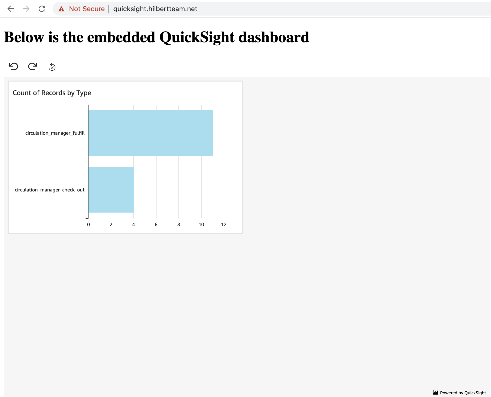

# quicksight-embedding-test
Testbed showing how to embed QuickSight dashboards into a web app.

## Usage
1. Using the following snippet create an IAM role allowing to generate embedded URLs of QuickSight dashboards 
and name it `QuickSightDashboardEmbedder`:
```
{
    "Version": "2012-10-17",
    "Statement": [
        {
            "Action": "quicksight:GetDashboardEmbedUrl",
            "Resource": "*",
            "Effect": "Allow"
        }
    ]
}
```

2. Using the snippet below create new IAM role `QuickSightDashboardBackend` that will be used by the app 
to assume `QuickSightDashboardEmbedder` role:
```
{
    "Version": "2012-10-17",
    "Statement": [
        {
            "Effect": "Allow",
            "Action": "sts:AssumeRole",
            "Resource": "arn:aws:iam::<YOUR_AWS_ACCOUNT_ID>:role/QuickSightDashboardEmbedder"
        }
    ]
}
```

3. Create new IAM user `quicksight-dasboard-backend` and give it programmatic access 
by generating a new pair of API keys.

4. Update trust relationships of `QuickSightDashboardEmbedder` and `QuickSightDashboardBackend` roles:
```
{
  "Version": "2012-10-17",
  "Statement": [
    {
      "Effect": "Allow",
      "Principal": {
        "AWS": "arn:aws:iam::<YOUR_AWS_ACCOUNT_ID>:user/quicksight-dasboard-backend"
      },
      "Action": "sts:AssumeRole"
    }
  ]
}
```

5. Create a new QuickSight user:
```bash
aws quicksight register-user \
    --aws-account-id <YOUR_AWS_ACCOUNT_ID> \
    --namespace default \
    --identity-type IAM \
    --iam-arn "arn:aws:iam::<YOUR_AWS_ACCOUNT_ID>:role/QuickSightDashboardEmbedder" \
    --user-role READER \
    --session-name tom.smith@hilbertteam.net \
    --email tom.smith@hilbertteam.net
```

6. Map `quicksight.hilbertteam.net` to localhost in `/etc/hosts`:
```
127.0.0.1       quicksight.hilbertteam.net
```

7. Whitelist `quicksight.hilbertteam.net` in QuickSight.

8. Rename [config.cfg.example](dashboard/config.cfg.example) to `config.cfg` and fill in all the credentials.

9. Run the testbed:
```bash
docker-compose build
docker-compose up
```

10. Open https://quicksight.hilbertteam.net in your browser and agree to open an unsafe website:
  


## References
1. [Embed interactive dashboards in your application with Amazon QuickSight](https://aws.amazon.com/blogs/big-data/embed-interactive-dashboards-in-your-application-with-amazon-quicksight/)